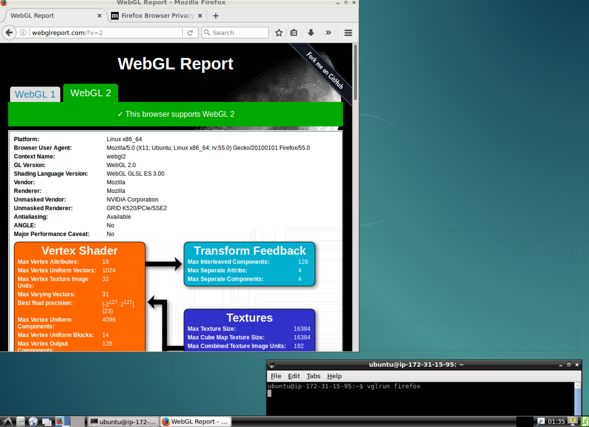

# ec2-setup

List of 4 scripts to prepare a stock Ubuntu AMI on AWS to act as a remote workstation, including 3D
 acceleration (when used with a GPU instance). 

The scripts (located under `scripts/`) take care of installing Lubuntu, TurboVNC, VirtualGL, Nvidia
drivers, Docker and nvidia-docker plugin to expose the graphics hardware to Docker containers and
enable the execution of 3D accelerated apps inside them.

I have successfully been using Docker images I built to remotely run ROS and Gazebo simulations on
G2 instances (see my `udacity-robond` Docker setup on both [GitHub](https://github.com/yrahal/udacity-robond) and
[Docker Hub](https://hub.docker.com/r/yrahal/udacity-robond/)).

## Installation

I've tested the scripts with a basic Ubuntu 16.04 image on a G2 instance.

_Hint_: use a spot instance and attach an external volume where you can save your work - This will
result in major cost savings!

The first step is to run the `install.sh` script:

`$ source install.sh`

The machine will reboot at the end of the process. You'll have to wait a bit and then reconnect to it.

Then, for a G2 instance:

`$ source install-nvidia-drivers-g2.sh`

An interactive installer will run, during which you'll have to accept the license and ignore the warnings.
The machine will again reboot at the end of the process.

Finally:

`$ source install-docker.sh`

This will install and configure Docker CE and the nvidia-docker plugin. No reboot this time, this
script will _just_ log you out at the end ;-) You can reconnect right away.

## Test

You can run:

`$ nvidia-smi`

To check that the hardware is correctly set up.

And if you plan on having Docker containers use the GPU:

`$ nvidia-docker run --rm nvidia/cuda nvidia-smi`

To check that it's correctly exposed to them (it should have the same output as the previous command).

The `nvidia/cuda` image is relatively big, so you can either choose to remove it afterwards if you
don't plan on using it, or to simply test with the Docker image you'll be using later.

## Usage

Now you can just run the `startup.sh` script to initiate the X server and launch VNC on `PORT 5901`
(the first time, it will ask you to create a password for the VNC server).

If you reboot your instance, or if you decide to save a snapshot of your instance and use it as an
image for future instances, then all you need is to run `startup.sh` once the instance is up.

When connecting, I prefer to only open `PORT 22` on the instance, and create an SSH tunnel for VNC
like so:

`$ ssh -i permission_file.pem -L 5901:localhost:5901 ubuntu@ip_address`

Then I can use a VNC client to connect to `localhost:5901`.

You can also open `PORT 5901` on your instance and directly connect to it, but the connection won't
be encrypted...

Make sure to use a VNC client that supports VirtualGL (TigerVNC, TurboVNC, ...). Once you're in, you'll
have a full Lubuntu desktop with hardware acceleration!

If you wish to view your desktop in the browser, you need to uncomment the final line in the `startup.sh`
script to run a noVNC server and then create an SSH tunnel for `PORT 6080`:

`$ ssh -i permission_file.pem -L 6080:localhost:6080 ubuntu@ip_address`

You can access your desktop in the browser at `localhost:6080/vnc.html`.

To take advantage of VirtualGL, launch your 3D applications prepended by `vglrun`. For example:

`$ vglrun firefox`

And visit http://webglreport.com/ to check that you're effectively using the Nvidia hardware :-)

## Docker Images

I mostly wrote this setup to be able to quickly spin a GPU instance and run Docker images I specifically
built for this purpose. You can find them here:

* General purpose dev environment Docker image: on [GitHub](https://github.com/yrahal/dev-machine) and on
[Docker Hub](https://hub.docker.com/r/yrahal/dev-machine/).
* Self-Driving Car Docker image: on [GitHub](https://github.com/yrahal/udacity-carnd) and on
[Docker Hub](https://hub.docker.com/r/yrahal/udacity-carnd/).
* Robotics Docker image: on [GitHub](https://github.com/yrahal/udacity-robond) and on
[Docker Hub](https://hub.docker.com/r/yrahal/udacity-robond/).

Once you're connected through VNC to your AWS instance, you can open a terminal and run a command such as:

`$ xhost +local:root`

`$ nvidia-docker run -it --env="DISPLAY" \`
                      `--volume="/tmp/.X11-unix:/tmp/.X11-unix:rw" \`
                      `--volume="/usr/lib/x86_64-linux-gnu/libXv.so.1:/usr/lib/x86_64-linux-gnu/libXv.so.1" \`
                      `yrahal/udacity-robond vglrun bash`

Which will spin a bash shell on the Docker container from which you can launch your 3D apps. Such as:

`$ gazebo`

This will run Gazebo in its full 3D accelerated glory! You don't need to preceed your commands with
`vglrun` here since it has already been applied on the original bash shell.

Once you're done with the container:

`$ xhost -local:root`

See the above links for more details.

## References

[Remote server setup for VNC](https://github.com/UV-CDAT/uvcdat/wiki/Remote-server-setup-for-VNC): 
TurboVNC and VirtualGL installation.

[Linux Accelerated Computing Instances]
(http://docs.aws.amazon.com/AWSEC2/latest/UserGuide/accelerated-computing-instances.html#install-nvidia-driver): 
Nvidia drivers installation.

[Using Docker to Set Up a Deep Learning Environment on AWS]
(https://medium.com/towards-data-science/using-docker-to-set-up-a-deep-learning-environment-on-aws-6af37a78c551): 
Nvidia-docker installation.

[HW accelerated GUI apps on Docker](https://medium.com/@pigiuz/hw-accelerated-gui-apps-on-docker-7fd424fe813e): 
Using Docker and VirtualGL for 3D applications.

[noVNC GitHub page](https://github.com/novnc/noVNC): noVNC installation and usage.
